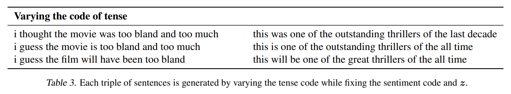

# TextStyleTransfer

Text style transfer manipulates the style of a sentence without changing the words used. For example, we might want to adjust the tense to of a sentence from past to present to future perfect.

*Taken from [Toward Controlled Generation of Text](https://arxiv.org/pdf/1703.00955.pdf)*

This project takes a slightly different approach, more similar to Neural Style Transfer; our objective is to create a new sentence F with the contents of a sentence C but the style of a sentence S. We accomplish this by optimizing the following objective:

where MSE is mean squared error. The frontend website is served using Flask.

Made at GTHacks 5: https://devpost.com/software/text-style-transfer.

## Dependencies
- Numpy
- PyTorch
- Scikit-learn
- fastText (just need .vec, [InferSent repo](https://github.com/facebookresearch/InferSent) has download instructions)
- NLTK
- Flask
